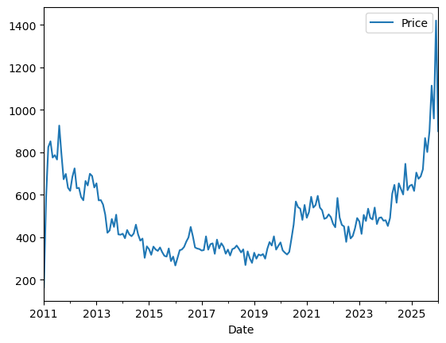
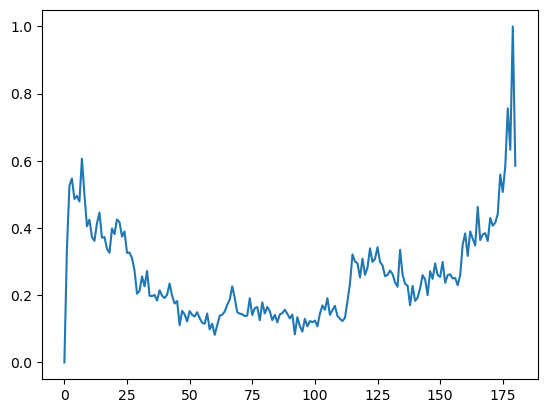
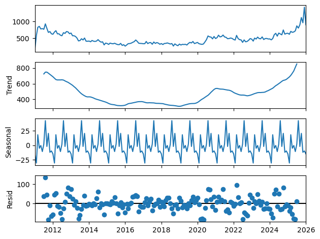
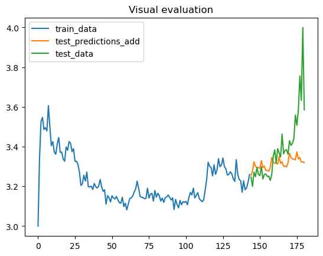
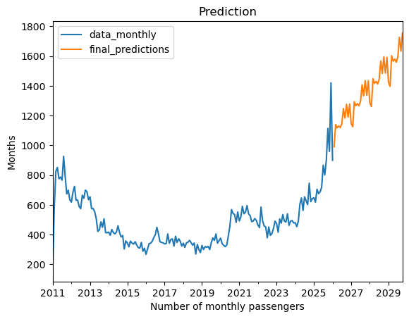

# Ex.No: 6               HOLT WINTERS METHOD

# Date: 16.05.2026

# AIM:

# ALGORITHM:
1. You import the necessary libraries
2. You load a CSV file containing daily sales data into a DataFrame, parse the 'date' column as
datetime, and perform some initial data exploration
3. You group the data by date and resample it to a monthly frequency (beginning of the month
4. You plot the time series data
5. You import the necessary 'statsmodels' libraries for time series analysis
6. You decompose the time series data into its additive components and plot them:
7. You calculate the root mean squared error (RMSE) to evaluate the model's performance
8. You calculate the mean and standard deviation of the entire sales dataset, then fit a Holt-
Winters model to the entire dataset and make future predictions
9. You plot the original sales data and the predictions

# PROGRAM:

```python
import pandas as pd
import numpy as np
import matplotlib.pyplot as plt
from statsmodels.tsa.holtwinters import ExponentialSmoothing
from sklearn.preprocessing import MinMaxScaler
from sklearn.metrics import mean_absolute_error, mean_squared_error
data = pd.read_csv('silver_prices_data.csv')
data.head()
data['Date'] = pd.to_datetime(data['Date'])
data=data.set_index('Date')
data_monthly = data.resample('MS').sum()
data_monthly.head()
data_monthly.plot()
scaler = MinMaxScaler()
scaled_data = pd.Series(scaler.fit_transform(data_monthly.values.reshape(-1, 1)).flatten())
scaled_data.plot()
from statsmodels.tsa.seasonal import seasonal_decompose
decomposition = seasonal_decompose(data_monthly, model="additive")
decomposition.plot()
plt.show()
scaled_data=scaled_data+1
train_data = scaled_data[:int(len(scaled_data) * 0.8)]
test_data = scaled_data[int(len(scaled_data) * 0.8):]
model_add = ExponentialSmoothing(train_data, trend='add', seasonal='mul',seasonal_periods=12).fit()
test_predictions_add = model_add.forecast(steps=len(test_data))
ax=train_data.plot()
test_predictions_add.plot(ax=ax)
test_data.plot(ax=ax)
ax.legend(["train_data", "test_predictions_add","test_data"])
ax.set_title('Visual evaluation')
np.sqrt(mean_squared_error(test_data, test_predictions_add))
np.sqrt(scaled_data.var()),scaled_data.mean()
final_model = ExponentialSmoothing(data_monthly, trend='add', seasonal='mul', seasonal_periods=12).fit()
final_predictions = final_model.forecast(steps=int(len(data_monthly)/4)) 
ax=data_monthly.plot()
final_predictions.plot(ax=ax)
ax.legend(["data_monthly", "final_predictions"])
ax.set_xlabel('Number of monthly passengers')
ax.set_ylabel('Months')
ax.set_title('Prediction')
```
# OUTPUT:











# RESULT:
Thus the program run successfully based on the Holt Winters Method model.
